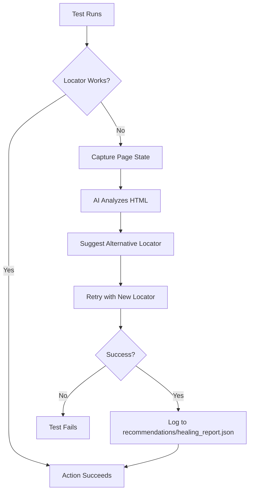

# AI-Enhanced Playwright Framework - Complete User Guide

> **A self-healing test automation framework that uses AI to automatically fix broken locators and provides comprehensive healing reports for automated code maintenance.**

## Table of Contents

- [Overview](#overview)
- [Key Features](#key-features)
- [Quick Start](#quick-start)
- [Installation](#installation)
- [Configuration](#configuration)
- [Writing Tests](#writing-tests)
- [Understanding Self-Healing](#understanding-self-healing)
- [Healing Reports](#healing-reports)
- [AI Provider Setup](#ai-provider-setup)
- [Advanced Usage](#advanced-usage)
- [Best Practices](#best-practices)
- [Troubleshooting](#troubleshooting)

---

## Overview

The AI-Enhanced Playwright Framework revolutionizes test automation by combining Playwright's powerful testing capabilities with AI-driven self-healing. When your tests encounter broken locators, the framework automatically:

1. **Detects** the failure in real-time
2. **Analyzes** the page using AI (Google Gemini, OpenAI, Claude, or Ollama)
3. **Suggests** alternative locators with high confidence
4. **Heals** the test by retrying with the new locator
5. **Documents** everything in comprehensive healing reports

This means **fewer flaky tests**, **less maintenance**, and **more time for actual testing**.

---

## Key Features

### 🤖 AI-Powered Self-Healing
- Automatically fixes broken locators using advanced AI models
- Works with all Playwright locator methods
- Supports locator chaining (filter, and_, or_, first, last, nth)

### 🔄 Multiple AI Providers
- **Google Gemini** (default) - Fast and cost-effective with free tier
- **OpenAI ChatGPT** - GPT-4o, GPT-4o-mini for high accuracy
- **Anthropic Claude** - Claude 3.5 Sonnet for complex scenarios
- **Azure OpenAI** - Enterprise-grade with SLA
- **Ollama** - Local LLMs for privacy and offline use

### 📊 Comprehensive Healing Reports
- **Automated Agent Ready**: Complete context for AI-driven code fixes
- **Root Cause Analysis**: Understand why tests fail
- **Alternative Fixes**: Multiple solutions with confidence scores
- **Validation Steps**: Verify fixes work correctly
- **Metadata & Tags**: Track patterns and categorize issues

### 🎯 Full Playwright API Support
All locator methods work seamlessly:
- Semantic locators: `get_by_role`, `get_by_label`, `get_by_text`, etc.
- CSS/XPath selectors: `locator(selector)`
- Chaining: `filter`, `and_`, `or_`, `first`, `last`, `nth`

### 🚀 Easy Integration
Drop-in replacement for standard Playwright - minimal code changes required.

---

## Quick Start

### 1. Install the Framework

```bash
# Basic installation (includes Google Gemini)
pip install ai-playwright

# With specific AI provider
pip install ai-playwright[openai]      # For ChatGPT
pip install ai-playwright[anthropic]   # For Claude
pip install ai-playwright[all-providers]  # For all providers
```

### 2. Install Playwright Browsers

```bash
playwright install
```

### 3. Set Up Your AI Provider

**For Google Gemini (default):**
```bash
export GEMINI_API_KEY="your-api-key-here"
```

Get your API key: https://makersuite.google.com/app/apikey

**For OpenAI ChatGPT:**
```bash
export AI_PROVIDER="openai"
export OPENAI_API_KEY="your-api-key-here"
```

Get your API key: https://platform.openai.com/api-keys

### 4. Create Your Test Configuration

Create `conftest.py`:

```python
import pytest
from playwright.sync_api import sync_playwright
from ai_playwright import AIPage

@pytest.fixture(scope="function")
def ai_page():
    with sync_playwright() as p:
        browser = p.chromium.launch(headless=True)
        context = browser.new_context()
        page = context.new_page()
        yield AIPage(page)
        browser.close()
```

### 5. Write Your First Test

Create `test_example.py`:

```python
def test_login(ai_page):
    ai_page.goto("https://example.com/login")
    
    # Use any Playwright locator method - they all support self-healing!
    ai_page.get_by_label("Email").fill("user@example.com")
    ai_page.get_by_label("Password").fill("password123")
    ai_page.get_by_role("button", name="Sign In").click()
    
    # If locators break, AI will automatically fix them
    assert ai_page.get_by_text("Welcome").is_visible()
```

### 6. Run Your Tests

```bash
pytest tests/
```

That's it! Your tests now have AI-powered self-healing capabilities.

---

## Installation

### Prerequisites

- Python 3.8 or higher
- pip package manager
- Internet connection (for AI healing)

### Installation Options

**Basic Installation:**
```bash
pip install ai-playwright
playwright install
```

**With Specific Providers:**
```bash
# OpenAI ChatGPT
pip install ai-playwright[openai]

# Anthropic Claude
pip install ai-playwright[anthropic]

# Ollama (Local)
pip install ai-playwright[ollama]

# All providers
pip install ai-playwright[all-providers]
```

### Verify Installation

```bash
python -c "from ai_playwright import AIPage; print('Installation successful!')"
```

---

## Configuration

### Environment Variables

Create a `.env` file in your project root:

```bash
# AI Provider Selection
AI_PROVIDER=gemini  # Options: gemini, openai, anthropic, azure, ollama

# API Keys (set the one for your chosen provider)
GEMINI_API_KEY=your-gemini-api-key
OPENAI_API_KEY=your-openai-api-key
ANTHROPIC_API_KEY=your-anthropic-api-key

# Optional: Model Selection
GEMINI_MODEL=gemini-2.0-flash-lite-preview-02-05
OPENAI_MODEL=gpt-4o-mini
ANTHROPIC_MODEL=claude-3-5-sonnet-20241022
```

### Provider-Specific Configuration

#### Google Gemini (Default)
```bash
AI_PROVIDER=gemini
GEMINI_API_KEY=your-key
GEMINI_MODEL=gemini-2.0-flash-lite-preview-02-05  # Optional
```
- **Free tier**: 15 requests per minute
- **Best for**: Development and testing
- **Speed**: ⚡⚡⚡ Very fast

#### OpenAI ChatGPT
```bash
AI_PROVIDER=openai
OPENAI_API_KEY=your-key
OPENAI_MODEL=gpt-4o-mini  # Recommended for balance
```
- **Models**: `gpt-4o`, `gpt-4o-mini`, `gpt-3.5-turbo`
- **Best for**: CI/CD and production
- **Speed**: ⚡⚡ Fast

#### Anthropic Claude
```bash
AI_PROVIDER=anthropic
ANTHROPIC_API_KEY=your-key
ANTHROPIC_MODEL=claude-3-5-sonnet-20241022
```
- **Models**: `claude-3-5-sonnet`, `claude-3-opus`, `claude-3-haiku`
- **Best for**: Complex healing scenarios
- **Speed**: ⚡⚡ Fast

#### Azure OpenAI
```bash
AI_PROVIDER=azure
AZURE_OPENAI_API_KEY=your-key
AZURE_OPENAI_ENDPOINT=https://your-resource.openai.azure.com/
AZURE_OPENAI_DEPLOYMENT=gpt-4
AZURE_OPENAI_API_VERSION=2024-02-15-preview
```
- **Best for**: Enterprise deployments
- **Features**: SLA, data residency, compliance

#### Ollama (Local)
```bash
AI_PROVIDER=ollama
OLLAMA_BASE_URL=http://localhost:11434
OLLAMA_MODEL=llama3
```
- **Best for**: Privacy, offline use
- **Setup**: Download from https://ollama.com/
- **Cost**: Free (runs locally)

### Programmatic Configuration

```python
from ai_playwright import AIPage, HealerAgent
from ai_playwright.core.model_providers import OpenAIProvider

# Option 1: Use provider name
healer = HealerAgent(provider="openai", model="gpt-4o-mini")
ai_page = AIPage(page)
ai_page.healer = healer

# Option 2: Use custom provider instance
provider = OpenAIProvider(api_key="your-key", model="gpt-4o")
healer = HealerAgent(provider=provider)
ai_page.healer = healer
```

---

## Writing Tests

### Supported Locator Methods

All Playwright locator methods are supported with self-healing:

#### Semantic Locators (Recommended)
```python
# By role (ARIA roles)
ai_page.get_by_role("button", name="Submit").click()
ai_page.get_by_role("link", name="Learn More").click()

# By label (form controls)
ai_page.get_by_label("Email").fill("user@example.com")
ai_page.get_by_label("Password").fill("password123")

# By text content
ai_page.get_by_text("Welcome Back").is_visible()
ai_page.get_by_text("Sign In", exact=True).click()

# By placeholder
ai_page.get_by_placeholder("Enter your email").fill("test@example.com")

# By alt text (images)
ai_page.get_by_alt_text("Company Logo").is_visible()

# By title attribute
ai_page.get_by_title("Close").click()

# By test ID
ai_page.get_by_test_id("submit-button").click()
```

#### CSS/XPath Locators
```python
# CSS selectors
ai_page.locator("#submit-btn").click()
ai_page.locator(".btn-primary").click()
ai_page.locator("button[type='submit']").click()

# XPath
ai_page.locator("//button[@id='submit']").click()
```

#### Locator Chaining
```python
# Filter locators
ai_page.get_by_role("listitem").filter(has_text="Active").click()

# Combine locators (AND)
ai_page.locator("button").and_(ai_page.get_by_text("Submit")).click()

# Union of locators (OR)
ai_page.locator("#btn1").or_(ai_page.locator("#btn2")).click()

# List operations
ai_page.get_by_role("button").first.click()
ai_page.get_by_role("button").last.click()
ai_page.get_by_role("button").nth(2).click()
```

### Complete Test Example

```python
import pytest
from playwright.sync_api import sync_playwright
from ai_playwright import AIPage

@pytest.fixture(scope="function")
def ai_page():
    with sync_playwright() as p:
        browser = p.chromium.launch(headless=False)
        context = browser.new_context(viewport={'width': 1280, 'height': 720})
        page = context.new_page()
        yield AIPage(page)
        browser.close()

def test_complete_user_flow(ai_page):
    """Test a complete user flow with self-healing locators"""
    
    # Navigate to application
    ai_page.goto("https://example.com")
    
    # Login
    ai_page.get_by_label("Username").fill("testuser")
    ai_page.get_by_label("Password").fill("password123")
    ai_page.get_by_role("button", name="Sign In").click()
    
    # Verify login success
    assert ai_page.get_by_text("Welcome, testuser").is_visible()
    
    # Navigate to profile
    ai_page.get_by_role("link", name="Profile").click()
    
    # Update profile
    ai_page.get_by_label("Display Name").fill("Test User")
    ai_page.get_by_role("button", name="Save Changes").click()
    
    # Verify success message
    assert ai_page.get_by_text("Profile updated successfully").is_visible()
    
    # Logout
    ai_page.get_by_role("button", name="Logout").click()
```

---

## Understanding Self-Healing

### How It Works



### The Healing Process

1. **Test Execution**: Your test runs normally using Playwright
2. **Failure Detection**: When a locator fails (TimeoutError), the framework captures:
   - Current page HTML (truncated to 5000 chars)
   - Action being attempted (click, fill, etc.)
   - Error message and stack trace
   - Browser and viewport information
3. **AI Analysis**: Your chosen AI provider analyzes the HTML and suggests:
   - Alternative locators with high confidence
   - Root cause of the failure
   - Best practices for stable locators
4. **Auto-Healing**: The test retries with the new locator
5. **Comprehensive Logging**: All details are saved to `recommendations/healing_report.json`

### What Gets Healed

The framework can heal:
- ✅ Broken CSS selectors
- ✅ Changed element IDs or classes
- ✅ Modified ARIA roles or labels
- ✅ Updated text content
- ✅ Restructured DOM hierarchies
- ✅ Dynamic content loading issues

### What Cannot Be Healed

- ❌ Completely removed elements
- ❌ Fundamental page structure changes
- ❌ Authentication or permission issues
- ❌ Network or server errors

---

## Healing Reports

### Overview

The framework generates **comprehensive healing reports** that provide everything needed for automated code maintenance. These reports are designed to be consumed by both humans and AI agents.

### Report Location

By default, healing events are logged to:
```
recommendations/healing_report.json
```

### Report Structure

Each healing event includes:

#### 1. Identification & Tracking
```json
{
  "id": "HEAL-893D611E",
  "timestamp": "2025-11-23T23:59:55.350300",
  "severity": "high",
  "status": "healed"
}
```

#### 2. Test Information
```json
{
  "test_info": {
    "test_name": "test_user_login",
    "test_file": "test_login.py",
    "test_class": null,
    "test_method": "test_user_login",
    "line_number": null
  }
}
```

#### 3. Error Details
```json
{
  "error_details": {
    "error_type": "TimeoutError",
    "error_message": "Locator.click: Timeout 30000ms exceeded...",
    "stack_trace": "Full stack trace...",
    "failure_count": 1,
    "action_attempted": "click"
  }
}
```

#### 4. Locator Analysis
```json
{
  "locator_issue": {
    "original_locator": "get_by_role('link', name='More info')",
    "original_locator_type": "role_based",
    "failed_reason": "Element not found or not visible within timeout period",
    "suggested_locator": "a[href='https://iana.org/domains/example']",
    "suggested_locator_type": "attribute_selector",
    "confidence_score": 0.85,
    "alternative_locators": []
  }
}
```

#### 5. Code Context
```json
{
  "code_context": {
    "file_path": "test_login.py",
    "function_name": "test_user_login",
    "problematic_line": "page.get_by_role('link', name='More info')",
    "code_snippet_before": "",
    "code_snippet_after": ""
  }
}
```

#### 6. Root Cause Analysis
```json
{
  "root_cause_analysis": {
    "primary_cause": "Dynamic content loading - element text or role may be rendered differently",
    "contributing_factors": [
      "Role-based locator may be too specific for dynamic content",
      "Possible timing issue with page rendering",
      "Element might load conditionally or asynchronously"
    ],
    "environmental_factors": {
      "browser": "chromium",
      "viewport": "{'width': 1280, 'height': 720}",
      "network_conditions": "normal"
    }
  }
}
```

#### 7. Suggested Fixes
```json
{
  "suggested_fix": {
    "fix_type": "locator_replacement",
    "priority": "high",
    "code_changes": [{
      "file": "test_login.py",
      "line_number": null,
      "original_code": "page.get_by_role('link', name='More info')",
      "fixed_code": "page.locator('a[href=\"https://iana.org/domains/example\"]')",
      "change_type": "replace"
    }],
    "alternative_fixes": [{
      "description": "Add explicit wait before interacting with element",
      "code": "page.wait_for_selector('a[href=\"...\"]', state='visible')\npage.locator('a[href=\"...\"]').click()"
    }],
    "validation_steps": [
      "Run the test 5 times to ensure stability",
      "Verify the locator works across different browsers",
      "Check if the fix handles edge cases (slow network, delayed rendering)"
    ]
  }
}
```

#### 8. AI Recommendations
```json
{
  "ai_recommendations": {
    "best_practice": "Attribute selectors are stable when targeting unchanging attributes like href or data-*",
    "preventive_measures": [
      "Add explicit waits for dynamic content",
      "Use multiple fallback locators",
      "Implement retry logic for flaky elements"
    ],
    "test_improvement": "Consider adding a custom fixture that waits for critical page elements"
  }
}
```

#### 9. Metadata
```json
{
  "metadata": {
    "healer_agent": "HealerAgent-v1.0",
    "healing_strategy": "locator_analysis_and_replacement",
    "auto_fix_eligible": true,
    "requires_human_review": false,
    "estimated_fix_time_seconds": 15,
    "related_issues": [],
    "tags": ["timeout_error", "role_based", "action_click", "timing_issue", "dynamic_content"]
  }
}
```

### Using Healing Reports

#### For Manual Review

```bash
# View the healing report
cat recommendations/healing_report.json | jq '.'

# Filter by severity
cat recommendations/healing_report.json | jq '.[] | select(.severity == "high")'

# Find auto-fix eligible items
cat recommendations/healing_report.json | jq '.[] | select(.metadata.auto_fix_eligible == true)'
```

#### For Automated Agents

```python
import json

# Read healing report
with open('recommendations/healing_report.json', 'r') as f:
    healing_data = json.load(f)

# Process each healing event
for entry in healing_data:
    if entry.get('metadata', {}).get('auto_fix_eligible') and entry.get('status') == 'healed':
        # Extract fix information
        file_path = entry['code_context']['file_path']
        original_code = entry['suggested_fix']['code_changes'][0]['original_code']
        fixed_code = entry['suggested_fix']['code_changes'][0]['fixed_code']
        
        print(f"File: {file_path}")
        print(f"Original: {original_code}")
        print(f"Fixed: {fixed_code}")
        print(f"Confidence: {entry['locator_issue']['confidence_score']}")
        print("---")
```

### Severity Levels

| Severity | Criteria | Action Required |
|----------|----------|-----------------|
| **Critical** | Multiple failures (count > 2) | Immediate fix required |
| **High** | Timeout errors | Fix within 1 day |
| **Medium** | Other errors | Fix within 1 week |
| **Low** | Minor issues | Fix when convenient |

### Locator Type Detection

| Type | Example | Pattern |
|------|---------|---------|
| `role_based` | `get_by_role('button', ...)` | Starts with `get_by_role` |
| `text_based` | `get_by_text('Submit')` | Starts with `get_by_text` |
| `id_selector` | `#submit-btn` | Starts with `#` |
| `class_selector` | `.btn-primary` | Starts with `.` |
| `attribute_selector` | `a[href="..."]` | Contains `[` and `]` |
| `xpath` | `//button[@id='submit']` | Starts with `//` |
| `css_selector` | `button.submit` | Default for other CSS |

### Custom Log File Location

```python
from ai_playwright import AIPage
from ai_playwright.utils.logger import ChangeLogger

# Use custom log file (default is recommendations/healing_report.json)
ai_page.logger = ChangeLogger("custom_path/healing_report.json")
```

---

## AI Provider Setup

### Cost Comparison

| Provider | Model | Speed | Cost | Recommended For |
|----------|-------|-------|------|-----------------|
| **Gemini** | gemini-2.0-flash-lite | ⚡⚡⚡ | 💰 Free tier | Development, testing |
| **OpenAI** | gpt-4o-mini | ⚡⚡ | 💰💰 ~$0.0015/heal | CI/CD, production |
| **OpenAI** | gpt-4o | ⚡ | 💰💰💰 ~$0.003/heal | Complex healing |
| **Anthropic** | claude-3-haiku | ⚡⚡⚡ | 💰 ~$0.001/heal | Fast healing |
| **Anthropic** | claude-3-5-sonnet | ⚡⚡ | 💰💰 ~$0.003/heal | High accuracy |
| **Azure** | gpt-4 | ⚡⚡ | 💰💰💰 Varies | Enterprise |
| **Ollama** | llama3 | ⚡ | Free | Privacy, offline |

### Provider Selection Guide

#### Choose Google Gemini if:
- ✅ You're developing or testing
- ✅ You want a free tier
- ✅ You need fast response times
- ✅ You want easy setup

#### Choose OpenAI if:
- ✅ You're running in CI/CD
- ✅ You need the fastest healing
- ✅ You want high reliability
- ✅ Cost is not a primary concern

#### Choose Anthropic Claude if:
- ✅ You have complex healing scenarios
- ✅ You want high accuracy
- ✅ You prefer Claude's reasoning

#### Choose Azure OpenAI if:
- ✅ You're in an enterprise environment
- ✅ You need SLA guarantees
- ✅ You require data residency
- ✅ You use Azure ecosystem

#### Choose Ollama if:
- ✅ You need complete privacy
- ✅ You work offline
- ✅ You have security requirements
- ✅ You want zero API costs

### Getting API Keys

#### Google Gemini
1. Visit https://makersuite.google.com/app/apikey
2. Click "Create API Key"
3. Copy the key
4. Set `GEMINI_API_KEY` environment variable

#### OpenAI
1. Visit https://platform.openai.com/api-keys
2. Click "Create new secret key"
3. Copy the key (you won't see it again!)
4. Set `OPENAI_API_KEY` environment variable

#### Anthropic
1. Visit https://console.anthropic.com/
2. Navigate to API Keys
3. Create a new key
4. Set `ANTHROPIC_API_KEY` environment variable

#### Azure OpenAI
1. Access Azure Portal
2. Create an Azure OpenAI resource
3. Deploy a model (e.g., gpt-4)
4. Get endpoint and key from resource
5. Set `AZURE_OPENAI_API_KEY` and `AZURE_OPENAI_ENDPOINT`

#### Ollama
1. Download from https://ollama.com/
2. Install and run: `ollama serve`
3. Pull a model: `ollama pull llama3`
4. Set `OLLAMA_BASE_URL=http://localhost:11434`

---

## Advanced Usage

### Custom Healer Configuration

```python
from ai_playwright import AIPage, HealerAgent
from ai_playwright.core.model_providers import GeminiProvider

# Create custom provider with specific settings
provider = GeminiProvider(
    api_key="your-key",
    model="gemini-2.0-flash-lite-preview-02-05"
)

# Create healer with custom provider
healer = HealerAgent(provider=provider)

# Use in AIPage
ai_page = AIPage(page)
ai_page.healer = healer
```

### Multiple Providers in One Test Suite

```python
import pytest
from ai_playwright import AIPage, HealerAgent

@pytest.fixture(scope="function", params=["gemini", "openai"])
def ai_page(request):
    """Test with multiple AI providers"""
    with sync_playwright() as p:
        browser = p.chromium.launch(headless=True)
        context = browser.new_context()
        page = context.new_page()
        
        ai_page_instance = AIPage(page)
        ai_page_instance.healer = HealerAgent(provider=request.param)
        
        yield ai_page_instance
        browser.close()
```

### Custom Timeout Configuration

```python
# Set default timeout for all actions
ai_page.set_default_timeout(10000)  # 10 seconds

# Set timeout for specific action
ai_page.get_by_role("button", name="Submit").click(timeout=5000)
```

### Extending the Logger

```python
from ai_playwright.utils.logger import ChangeLogger

class CustomLogger(ChangeLogger):
    def log_change(self, test_name, original_locator, new_locator, error_message, **kwargs):
        # Add custom logic before logging
        print(f"Healing detected in {test_name}")
        
        # Call parent method
        super().log_change(test_name, original_locator, new_locator, error_message, **kwargs)
        
        # Add custom logic after logging
        self._send_alert_to_team(test_name, original_locator)
    
    def _send_alert_to_team(self, test_name, locator):
        # Custom alert logic
        pass
```

### Conditional Healing

```python
from ai_playwright import AIPage

class ConditionalAIPage(AIPage):
    def __init__(self, page, enable_healing=True):
        super().__init__(page)
        self.enable_healing = enable_healing
    
    def _perform_action(self, locator, action_name, *args, **kwargs):
        if not self.enable_healing:
            # Use standard Playwright without healing
            return getattr(locator, action_name)(*args, **kwargs)
        
        # Use healing
        return super()._perform_action(locator, action_name, *args, **kwargs)
```

---

## Best Practices

### 1. Locator Selection

**✅ DO:**
- Use semantic locators (`get_by_role`, `get_by_label`) when possible
- Prefer `data-testid` attributes for critical elements
- Use attribute selectors for stable attributes (href, type, etc.)

**❌ DON'T:**
- Rely solely on CSS classes (they change frequently)
- Use overly specific XPath expressions
- Use text content that may be translated or change

### 2. Healing Report Management

**✅ DO:**
- Review `recommendations/healing_report.json` regularly (daily in active development)
- Apply suggested fixes to make tests more stable
- Track patterns in healing events
- Use tags to categorize and analyze issues

**❌ DON'T:**
- Ignore healing reports (they indicate fragile tests)
- Let healing events accumulate without action
- Rely on healing as a permanent solution

### 3. API Key Security

**✅ DO:**
- Use environment variables for API keys
- Add `.env` to `.gitignore`
- Use different keys for dev/staging/production
- Rotate keys regularly

**❌ DON'T:**
- Hardcode API keys in code
- Commit API keys to version control
- Share API keys in chat or email
- Use production keys in development

### 4. Performance Optimization

**✅ DO:**
- Set appropriate timeouts (balance speed vs. healing accuracy)
- Use headless mode in CI/CD
- Cache browser contexts when possible
- Monitor API usage and costs

**❌ DON'T:**
- Set timeouts too low (healing needs time)
- Run with headed browser in CI/CD
- Create new browser instances for every test
- Ignore rate limits

### 5. Test Design

**✅ DO:**
- Write tests that are resilient to minor UI changes
- Use page object model for better maintainability
- Add explicit waits for dynamic content
- Test critical paths with multiple locator strategies

**❌ DON'T:**
- Write brittle tests that break on every UI change
- Mix test logic with locator logic
- Assume elements are immediately available
- Rely only on healing without improving test design

---

## Troubleshooting

### Common Issues

#### 1. Healing Not Working

**Symptoms:**
- Tests fail without attempting to heal
- No entries in `recommendations/healing_report.json`

**Solutions:**
```python
# Verify AIPage is being used
from ai_playwright import AIPage
ai_page = AIPage(page)  # Not just 'page'

# Check API key is set
import os
print(os.getenv('GEMINI_API_KEY'))  # Should not be None

# Verify provider is configured
print(ai_page.healer.provider)  # Should show provider info
```

#### 2. API Key Errors

**Symptoms:**
```
ValueError: OPENAI_API_KEY is required for OpenAIProvider
```

**Solutions:**
```bash
# Check environment variable
echo $OPENAI_API_KEY

# Set in .env file
echo "OPENAI_API_KEY=your-key" >> .env

# Load .env in Python
from dotenv import load_dotenv
load_dotenv()
```

#### 3. Import Errors

**Symptoms:**
```
ImportError: openai package is required for OpenAIProvider
```

**Solutions:**
```bash
# Install provider package
pip install ai-playwright[openai]

# Or install all providers
pip install ai-playwright[all-providers]
```

#### 4. Slow Healing

**Symptoms:**
- Healing takes more than 30 seconds
- Tests timeout during healing

**Solutions:**
```python
# Increase timeout
ai_page.set_default_timeout(60000)  # 60 seconds

# Use faster provider
healer = HealerAgent(provider="gemini")  # Fastest

# Use faster model
healer = HealerAgent(provider="openai", model="gpt-3.5-turbo")
```

#### 5. Empty Healing Reports

**Symptoms:**
- `recommendations/healing_report.json` is empty or missing

**Solutions:**
```python
# Check file permissions
import os
os.access('recommendations/healing_report.json', os.W_OK)  # Should be True

# Verify logger is configured
print(ai_page.logger.log_file)  # Should show file path

# Manually trigger logging
from ai_playwright.utils.logger import ChangeLogger
logger = ChangeLogger()
logger.log_change("test", "old", "new", "error")
```

#### 6. Rate Limit Errors

**Symptoms:**
```
Error: Rate limit exceeded
```

**Solutions:**
```bash
# For Gemini: Wait or upgrade to paid tier
# Free tier: 15 requests per minute

# For OpenAI: Check your usage limits
# https://platform.openai.com/account/limits

# Use local provider (no limits)
AI_PROVIDER=ollama
```

### Debug Mode

Enable debug logging:

```python
import logging

# Enable debug logging
logging.basicConfig(level=logging.DEBUG)

# Run your test
# You'll see detailed logs of the healing process
```

### Getting Help

If you encounter issues:

1. **Check the documentation**: Review this guide
2. **Review healing reports**: Check `recommendations/healing_report.json` for clues
3. **Enable debug logging**: See what's happening under the hood
4. **Check GitHub Issues**: https://github.com/yourusername/ai-playwright/issues
5. **Create a minimal reproduction**: Isolate the problem in a simple test

---

## Summary

The AI-Enhanced Playwright Framework provides:

- ✅ **Self-healing tests** that automatically fix broken locators
- ✅ **Multiple AI providers** for flexibility and choice
- ✅ **Comprehensive healing reports** for automated code maintenance
- ✅ **Full Playwright API support** with minimal code changes
- ✅ **Production-ready** with enterprise features

### Quick Reference

```python
# Installation
pip install ai-playwright[all-providers]
playwright install

# Configuration
export AI_PROVIDER=gemini
export GEMINI_API_KEY=your-key

# Usage
from ai_playwright import AIPage
ai_page = AIPage(page)
ai_page.get_by_role("button", name="Submit").click()

# Review healing
cat recommendations/healing_report.json | jq '.'
```

### Next Steps

1. ✅ Install the framework
2. ✅ Set up your AI provider
3. ✅ Write your first test
4. ✅ Review healing reports
5. ✅ Apply suggested fixes
6. ✅ Enjoy stable, self-healing tests!

---

**Version**: 1.0  
**Last Updated**: November 24, 2025  
**License**: MIT  
**Support**: https://github.com/yourusername/ai-playwright

---

*Happy Testing! 🚀*
